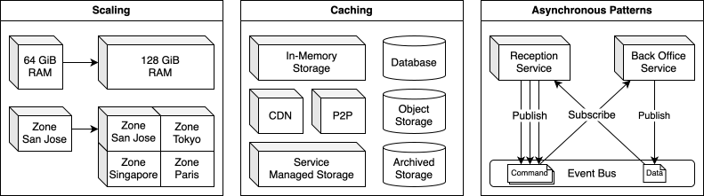

<!--
Prompt:
For the whole article:
Fix and improve the writing where any of the following conditions are satisfied:

1. Grammar error or typo
2. Expression is not customary for native speakers

Keep the meaning consistent.
Don't change other text.
-->

> This article is not meant to be a guide. It merely serves as a personal note and may not have a clear structure or polished content. This note should never be considered finished.

## Essential Principles

- Scaling: Increase computing power.
- Caching: Add layers to the storage hierarchy.
- Asynchronous Patterns: Don't wait; just subscribe and publish.

## Dimensions of Scaling

### Terminology

- Scale up (vertical scaling): Increase the capacity of a single computer system by upgrading or adding resources, typically hardware resources.
- Scale out (horizontal scaling): Add more systems to distribute the workload.

### How to choose

- Choose vertical scaling if: 
  - The service is in the early stage and has a relatively small codebase, so it uses monolithic architecture to follow the KISS principle.
  - The service is highly stateful and requires strict ACID properties, such as a traditional relational database storing customer transactions for a bank. Some modern commercial ACID databases can be distributed.
  - An immediate performance issue needs to be resolved.
- Choose horizontal scaling if:
  - High availability is critical for the service. This doesn't necessarily mean that the service's architecture needs to be altered.
  - High traffic is anticipated and long-term cost-effectiveness at scale is a major concern.
  - The service is mostly stateless or purely functional.
  - Following cloud-native best practices is essential for the nature of the business.

<!-- Separator 1 -->
