> 这是一篇短文，不会有过多的细节描述，可能会比较精简。

在 [OAuth 2.1 标准](https://www.ietf.org/archive/id/draft-ietf-oauth-v2-1-13.html)中，Authorization Code（授权代码）流程涉及一些不太符合直觉的步骤和要求，其中就包括了 PKCE（[RFC 7636](https://datatracker.ietf.org/doc/html/rfc7636)）。虽然 PKCE 对于增强安全性的作用非常显然，但是为什么要这样实现，这种机制的本质原理和解决的底层问题是什么呢？笔者将尝试在这篇短文中谈一下自己的理解。

首先，~~抛开安全不谈~~，以下是一个非常符合直觉的授权流程：

1. 用户 U 尝试使用客户端 C 访问资源 R。
2. 资源 R 告诉客户端 C：~~你手上没有牌~~，先让用户 U 去授权服务 A 那里验证身份，然后再从那里获得鉴权令牌。
3. 客户端 C 访问服务 A，然后让用户 U 进行下一步操作。**（转交操作一）**
4. 用户 U 很老实地验证了身份并允许「隐私换便利」。
5. 服务 A 在用户的许可下把鉴权令牌直接给客户端 C。**（转交操作二）**
6. 客户端 C 从此之后（至少在相当一段时间里）都可以拿着鉴权令牌访问资源 R 了。

好了，~~现在不抛开安全~~，所以这个流程的问题在哪里？从本质上来说，就是以下几个问题：

1. 转交操作二容易不经意地泄露鉴权令牌。例如：用户不知道这个重定向 URL 中存在敏感信息，随便分享了给别人。
2. 攻击者可以从转交操作二开始硬塞给客户端 C 任意鉴权令牌，或者在两个转交操作中间发起 CSRF 攻击，客户端 C 没有足够可靠的信息确认转交操作二对应着自己发起的流程。
3. 服务 A 如何确认两次转交操作都是来自或到达同一个客户端 C，而不是被攻击者拦截。例如：攻击者的「锅架翻炸」app 告诉操作系统将某域名的网页访问都跳转到自己，从而成为转交操作二中的拦路虎，窃取到鉴权令牌。

先考虑一下问题 1、2，其实只需要把流程稍微改进一下：

1. 用户 U 尝试使用客户端 C 访问资源 R。
2. 资源 R 告诉客户端 C：~~你手上没有牌~~，先让用户 U 去授权服务 A 那里验证身份，然后再从那里获得鉴权令牌。
3. 客户端 C 访问服务 A，**并告诉服务 A 一个随机口令**，然后让用户进行下一步操作。
4. 用户 U 很老实地验证了身份并允许「隐私换便利」。
5. 服务 A 在用户的许可下把**临时通行证**给客户端 C，**并携带上之前收到的随机口令**。
6. **客户端 C 确保随机口令前后一致（保证了属于自己发起的流程），再用临时通行证向授权服务 A 申请得到鉴权令牌。**
7. 客户端 C 从此之后（至少在相当一段时间里）都可以拿着鉴权令牌访问资源 R 了。

这样一来，重定向 URL 中无需包含敏感信息，只需要携带有效期很短的临时通行证，因此解决了问题 1；客户端 C 通过对比随机口令，确保收到的重定向是自己发起的流程，因此解决了问题 2。本质上来说，这个流程解决了「**客户端 C 验证来自服务 A 的所有请求都归属于同一可信流程**」这个根本问题。但是这个流程并不能解决问题 3，在流程快结束时仍然有风险，不妨考虑以下场景：

1. 攻击者的「锅架翻炸」app 劫持了重定向，得到了临时通行证。
2. 攻击者用临时通行证向服务 A 申请得到鉴权令牌。

为了解决问题 3，就需要使用 PKCE。本质上来说，PKCE 就是为了解决「**服务 A 验证来自客户端 C 的请求都归属于同一可信流程**」这个根本问题。为了更方面描述引入 PKCE 后的流程，不妨将签名函数（往往是散列函数）记作 $H(x)$，客户端 C 随机生成的消息（即签名前的数据）记作 $m$，客户端 C 对 $m$ 的签名（即 $H(m)$）记作 $d$。引入 PKCE 后的授权流程如下：

1. 用户 U 尝试使用客户端 C 访问资源 R。
2. 资源 R 告诉客户端 C：~~你手上没有牌~~，先让用户 U 去授权服务 A 那里验证身份，然后再从那里获得鉴权令牌。
3. **客户端 C 事先确定了 $H(x)$，当场随机生成了 $m$，并签名得到 $d$。**
4. 客户端 C 访问服务 A，**并携带上 $H(x)$ 和 $d$**，然后让用户进行下一步操作。
5. 用户 U 很老实地验证了身份并允许「隐私换便利」。
6. 服务 A 在用户的许可下把临时通行证给客户端 C，**并携带上 $d$**。
7. **客户端 C 确保 $d$ 前后一致**，再用临时通行证向授权服务 A 申请鉴权令牌，**并携带上 $m$**~~（某种意义上可以理解为摊牌）~~。
8. **服务 A 利用 $H(x)$ 验证客户端 C 告知的 $m$ 确实能签名得到 $d$，再把鉴权令牌告诉给客户端 C**。
9. 客户端 C 从此之后（至少在相当一段时间里）都可以拿着鉴权令牌访问资源 R 了。

至此，终于得到了一个足够稳健的授权流程了。可见，整个 PKCE 授权流程中的细节是不是都很合理，一点都不多余呢？